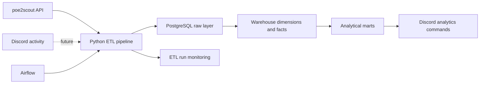

# FarmerBot Data Architecture

FarmerBot is being extended from a Discord-only bot into a small data
engineering system for Path of Exile market data.

## Target Flow



## Current Layers

- `farmerbot.raw_poe2scout_response` stores raw API responses as JSONB.
- `farmerbot.dim_item`, `farmerbot.dim_category` and `farmerbot.dim_league`
  model descriptive entities.
- `farmerbot.fact_price_snapshot` stores historical item price observations.
- `farmerbot.fact_price_log` stores normalized poe2scout `PriceLogs` points
  using the source timestamp returned by the API.
- `farmerbot.etl_run` tracks pipeline status and load counts.
- `farmerbot.data_quality_issue` stores validation problems found during load.
- `farmerbot.mart_item_snapshot_prices` exposes an analytical view over loaded
  snapshots.
- `farmerbot.mart_item_price_history` exposes source-time price history from
  poe2scout logs.

## Runtime Components

- Discord bot: serves live and historical market insights.
- PostgreSQL: local warehouse for raw and transformed market data.
- Python ETL: extracts poe2scout data, validates it and loads warehouse tables.
- poe2scout price logs: requested with configurable `DataPoints` and
  `FrequencyHours`; the default project configuration stores 7 hourly points.
- Airflow DAG: orchestration entry point for scheduled ingestion.

## VPS Database Access

The PostgreSQL service is intentionally not exposed with a host `ports` mapping.
It is available only inside the Docker Compose network to `farmerbot` and
`market-ingestion`.

To inspect the database on a VPS, connect over SSH and run:

```bash
docker compose exec postgres psql -U farmerbot -d farmerbot
```

## Useful Commands

Run the app stack:

```bash
docker compose up --build
```

Run one ingestion job through Docker Compose:

```bash
docker compose --profile jobs run --rm market-ingestion
```

Run the ingestion job locally:

```bash
python -m bot.data.pipeline
```

Run a single category locally:

```bash
python -m bot.data.pipeline --category currency --reference-currency exalted --reference-currency chaos
```

Inspect poe2scout payload cadence:

```bash
python helpful_scripts/inspect_poe2scout_cadence.py currency exalted --frequency-hours 1 --data-points 7
```
